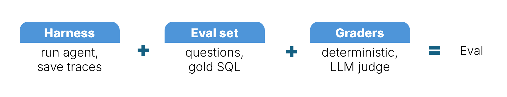
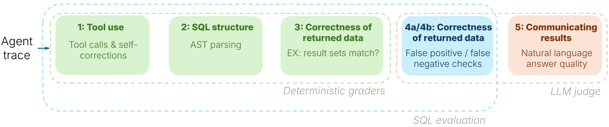
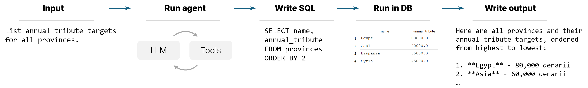
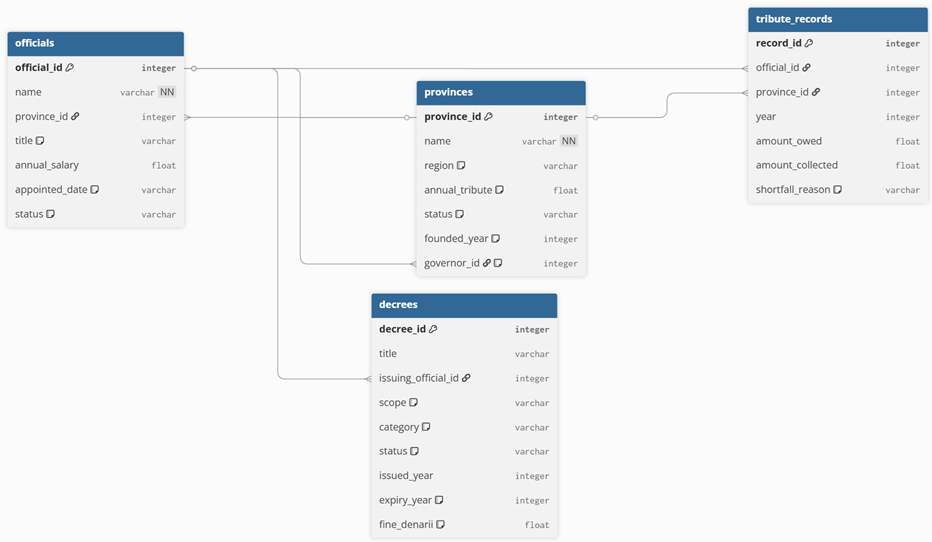
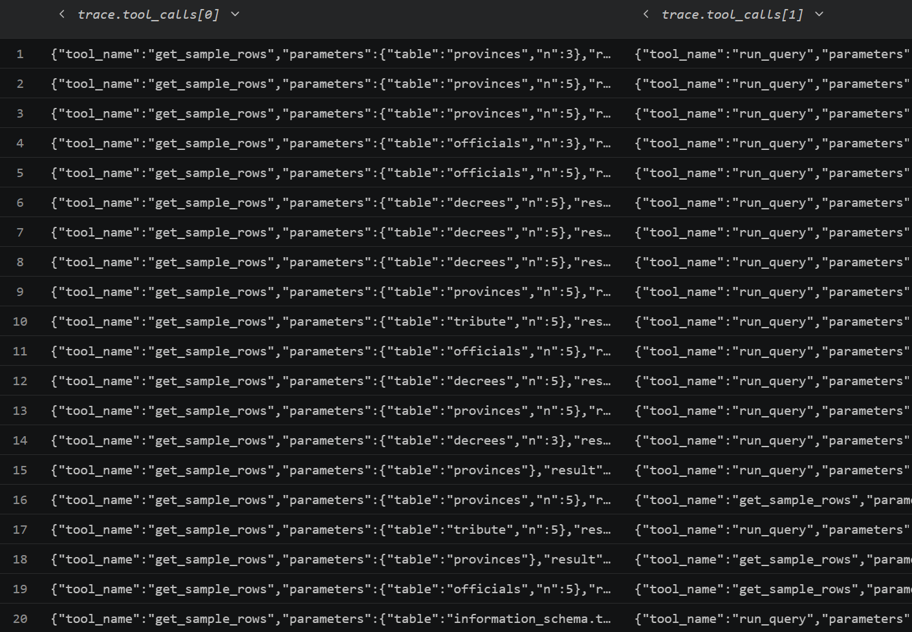
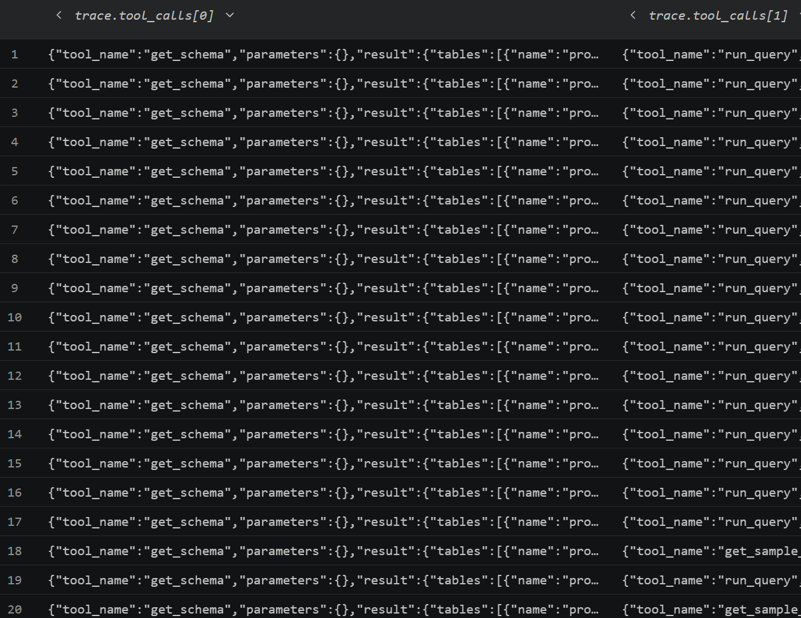
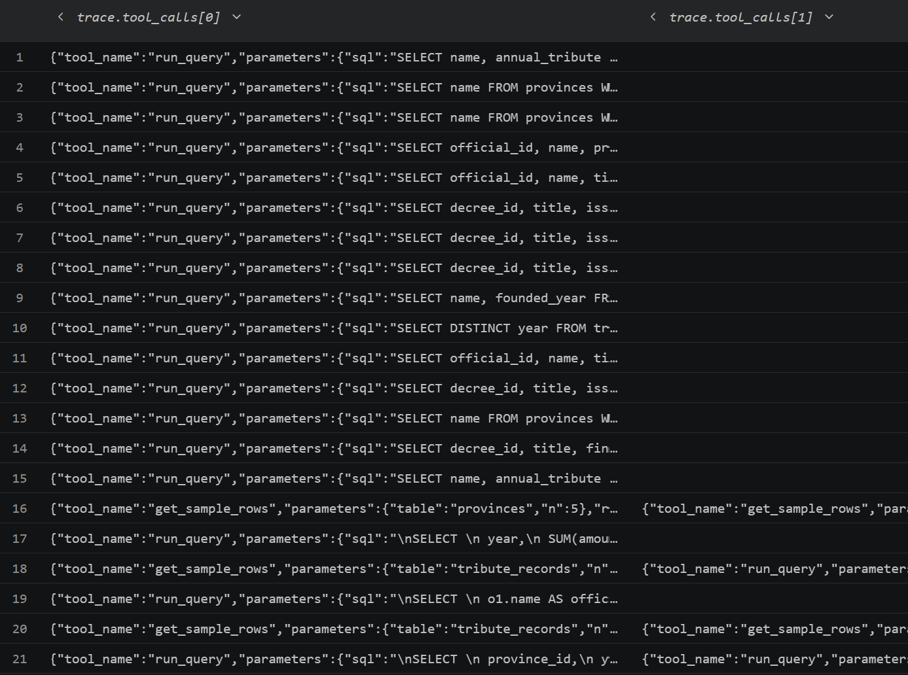

# Building and scaling evals for AI agents
<h2><i>Harness, eval set, graders</i></h2>
===

# TLDR
This is an end-to-end guide to creating an eval for an agent. An eval is: harness + eval set + graders. Here's what it describes:
1. Set up the environment: agent, 3 tools and a DB <- optional if you have an actual env
1. Create an eval set: questions and gold answers
1. Manually check the eval set
1. Create graders:
    * deterministic: result set match, SQL structure similarity between gold SQL and written by the agent
    * LLM-as-a-judge: double-check for false positives / false negatives from deterministic graders + evaluation of the agent's natural language response
1. Define the eval harness: I used `langchain` for easy model/provider swap and tool calling
1. Calibrate the graders: check if deterministic graders output what's expected and LLM judge are coherent
1. Run the entire eval suite through the harness
1. Look at the result and improve the agent
1. Learnings and production considerations: going beyond a single agent
1. Where to go from here

Good if you've decided to build evals and need an end-to-end guide.

**Repo**: https://github.com/nicpo/ai-agent-evals

# What are evals and when you need them
The purpose of evals is to check if the agent is in alignment with your goals, and measurably bring it into alignment if not. 



3 components to an eval:
1. Harness: runs the agent, saves traces
1. Eval set: questions to ask the agent, gold answers (in our case, this is gold SQL)
1. Graders: we can check whether the answer is correct using deterministic graders,  double-check the deterministic graders and check the quality of the natural language response.

What evals are is a well-trodden topic. Many posts and papers, like Hamel Husain's ["Your AI Product Needs Evals"](https://hamel.dev/blog/posts/evals), do a great job in explaining that.


## When you need evals

1. Agent developer: if you've authored an agent, use evals to show users that your agent works
1. Team manager or PM for a team that creates agents: use evals to define goals for agent functionality ("the agent should get data, write a report and send it to stakeholders via chat") and track progress towards them (does the agent collect appropriate data? how's the quality of the report it wrote? did it correctly identify the recipients?) - for both existing and hill-climb functionality
1. In production, to continuously monitor the agent and catch drift
    * Maybe a model that your agent uses [suddenly becomes unavailable](https://www.anthropic.com/news/fable-mythos-access)
1. In CI, to check what happens when you change the prompt, update the tools or change the model

Let's go!


# Eval set

The eval set includes:
* Questions to ask the agent
* Correct answer -> here, this is the "gold SQL" that answers the question

Here we have 61 questions across 4 levels of difficulty (easy -> medium -> hard -> extra-hard), consistent with [Spider evaluation](https://arxiv.org/abs/1809.08887). 17 of these questions also double as an adversarial case. (Note that I'm using Spider's difficulty taxonomy here, not comparing eval results to its [benchmark scores](https://spider2-sql.github.io/).)


## Creating the eval set

I had Claude create an initial set of evals. It makes sense as a first pass, but don't stop there. Review the synthetic data. Like, *REVIEW* it. There were data bugs - see the "Eval QA" section.

Eval sets are stored in JSONL files. If you do that too (you should), `JSONL Gazelle` is a helpful VS code plugin to work with them (made by someone working on evals!).


### An aside: value of domain expertise
Domain expertise that you need for creating evals is becoming more expensive. When I was training ML models 10 years ago, I could have data for them labeled for cents on Amazon Mechanical Turk (with meaningful exceptions like medical data, which was and is expensive).

For evals, you need someone with deep domain expertise. Like here: a person who can say when a SQL is correct costs more than a few cents. And finding someone who knows ancient Rome is even harder. The 9% of American adults who confess to [thinking about Rome weekly](https://yougov.com/en-us/articles/50546-what-americans-think-about-the-roman-empire) sounds like a deep pool. I'm in that 9%, and I still had to look things up.

## How many evals?
I created 61 evals. That might seem low. If you're in ML, you're probably used to test sets anywhere from hundreds to millions. But eval sets in the dozens are actually typical. Evals measure specific failures (can an agent write JOINs, does it check the DB schema before writing the query). If the agent doesn't check the schema, it won't check it on 1 eval and on 100 evals. The fix is to just tell the agent explicitly to check the schema.

"Quality over quantity" is an evals mantra: better have a few high quality, diverse evals than many repetitive ones.

Again, a contrast with ML. There, examples close to the decision boundary are the most challenging ones: for a dog-vs-cat image classifier, is this furry creature a dog or a cat? You want more of them in test to ensure the model is systematically correct


## Levels of evals

Performance tracking vs hill climbing:
* Performance tracking help check if the agent is performing as currently expected. If they fail, something broke (e.g. a tool regression)
* Hill-climbing evals help track progress towards future functionality.


## Watch out for...

**Adversarial examples**. I added questions that require the agent to:
a. discover enum values in a field (`shortfall_reason` has `corruption, famine, war, rebellion, none`) to correctly filter
b. handle empty results
c. understand when field values and names are phrased differently in the question than in the database. The `decrees` table has `scope = 'empire-wide'` or `'provincial'`. Some eval questions ask about "imperial" and "province-wide" decrees, so the agent has to figure out how to map them to correct field values.

Figure out the weak spots of your agent or data and create evals to test them.

**Evals contamination**. Don't put your evals anywhere near where your agent or model can see them (public repos, shared spreadsheets etc). The agent will learn them and will answer everything at 100%. (This is a similar problem to test data leakage in ML.)


# Graders
It's not enough to have a question and the correct answer, as we defined them in the eval set. Who's to judge? How do we determine whether the agent output matches the correct answer and answers the question?

Graders measure if the agent's output is correct, and how correct. We have 5 tiers of graders (some people prefer "evaluators"). There's nothing special about number 5, it just so happened when we created deterministic and LLM graders. 1-3 are deterministic, and 4-5 are LLM-based.
1. Tool use: did the agent use tools correctly?
2. SQL structure: is the SQL structurally sound?
3. Returned data correctness: did we get the right data?
4. False positive/false negative checks: did we get the right data *for the wrong reason*? Or if the answer is wrong, is it wrong in a way that matters?
5. Communicating results: did it communicate the answer well?



SQL is interesting: there *is* a correct answer, so we can use deterministic graders. But that correct answer might be right for a wrong reasons, so we need to double-check the deterministic grader.

Our agent also writes a natural-language response. We'll evaluate it with an LLM judge. And some agents don't have a "correct" answer at all. If your agent writes a document or slides that you want to evaluate, you'll have to rely on LLM judge more and you'll need a rubric.


## Deterministic

1. [Tool use](graders/tool_call.py): check which tools the agent called, whether the query didn't return an error and whether the agent self-corrected if there was an error.

1. [SQL structure](graders/sql_structural.py): use [sqlglot](https://sqlglot.com/sqlglot.html): to parse the agent's query and identify any hallucinated columns

1. [Returned data correctness](graders/execution.py): run both the agent's SQL and the gold SQL against the DB and compare result sets (this is Execution Accuracy, **EX**); also compare which SQL clauses match the gold query: `SELECT, WHERE, GROUP BY, ORDER BY`, and `JOIN` type (Exact Set Match, ESM).


### Checking graders for correctness

After you run your eval set through these graders, eyeball 20-30 eval examples, their grades, and see if anything's fishy. For example:
* Column aliases written by the agent are flagged as hallucinated columns. `SUM(...) AS total_tribute_collected ... ORDER BY total_tribute_collected` - checker looked up `total_tribute_collected` in the schema, didn't find it, and flagged it as hallucinated. <- Fix is to have the grader collect all aliases and exclude them from the hallucination check
* A grader checks against gold `expected_join_count` but there are several valid approaches that produce different JOINs (e.g. 2 without a CTE, 3 with a CTE) <- Fix is to set `expected_join_count` to `NULL`

## LLM as a judge

4a/4b. Depending on EX, I use an LLM judge to double-check for over- or under-zealousness of the deterministic grader (this idea is from Kim et al., 2025):
a. EX = result sets match: check for false positive
b. EX = don't match: check for false negative.

These checks produce **Adjusted Correctness**: the agent's answer was substantively right even if the SQL didn't exactly match gold:
* EX passed and (a) said "not an FP"
* EX failed but (b) said there's a valid alternative interpretation

5. Quality of the natural language answer:
a. Faithfulness: whether the nat-lang answer accurately reflects the output from the DB (this can also be taken off the shelf as a [deepeval metric](https://deepeval.com/docs/metrics-faithfulness))
b. Uncertainty acknowledgment: whether the answer acknowledges any "non-standard" results (`NULL`s, zero rows, ties)
c. Question alignment: check if the answer addresses the question as asked
d. (optional) Error recovery: if the agent's query failed, check if the agent fixed the error


### Calibrating the LLM judge

To make sure the judge's rubric is good, check two things: does the judge agree with you, and does it agree with itself?

**Manual.** Sample 20-30 examples, grade them yourself and compare with LLM output. Look for patterns: e.g. does it systematically under-grade certain cases?

**Test-retest**. Run the same example through the judge several times (3, 5) and check the judge's consistency. An easy example that has different scores on 3 runs shows a likely problem with the rubric problem.

```text
============================================================
JUDGE CALIBRATION - false-positive check
judge: gpt-5-4 | repeats: 3 | candidates (EX=True): 19 | sampled: 15
sample by difficulty: easy:4  extra-hard:1  hard:5  medium:5
============================================================

  id          difficulty  majority              votes
  easy_009    easy        FALSE_POSITIVE (3/3)  FALSE_POSITIVE, FALSE_POSITIVE, FALSE_POSITIVE
  easy_015    easy        CORRECT (3/3)         CORRECT, CORRECT, CORRECT
  extra_002   extra-hard  CORRECT (3/3)         CORRECT, CORRECT, CORRECT
  hard_002    hard        FALSE_POSITIVE (2/3)  FALSE_POSITIVE, CORRECT, FALSE_POSITIVE
  hard_016    hard        CORRECT (3/3)         CORRECT, CORRECT, CORRECT
  ...

  Self-consistency (avg majority share): 97.8%
  Unanimous cases:                       93.3%
```

With 93.3% of runs agreing exactly on the score, our false-positive rubric looks good. But if it didn't, we could review the rubric and make the language more specific, or fix it by providing examples of what each score means (midpoint are often the hardest to define). For example:
```text
Score FAITHFULNESS - does the answer accurately represent the result set?
...
3 - Answer mostly correct but omits something meaningful from the result set that
    the question asked for, or adds a minor unsupported inference.
    **For example: the question asks "What is the total tribute collected for each province?" The result set lists 13 provinces with amounts. The agent answers: "Egypt was the top contributor with 333,000 denarii, followed by Asia at 234,000." This is correct but incomplete, as the question asked for *all* provinces.**
```

Still off?
* Low agreement with your scores -> find the pattern first (too strict on X? too lenient on Y?), then rewrite that criterion
* Low test-retest -> add few-shot examples like shown above
* Switch to a binary rubric (right / wrong) or pairwise comparison ("for input X, is response A or B better?")

Once your rubric is stable, run the judge at near-0 temperature for deterministic outputs.


### Watch out for...
The goal of the FP check is to differentiate inconsequential variations from logic errors. `WHERE annual_tribute IS NOT NULL` on a non-nullable field is a redundant filter for sure, but it's harmless.

Be mindful of token spend. SQL queries and our toy tables aren't much data. But if we were making an agent for, say, extraction of clauses from contracts, which can run into many pages, we'd almost certainly blow past API rate limits somewhere.


# Harness
The harness runs the agent against the eval set and captures traces: tool calls, generated queries, query results, the natural-language answer. That trace is what graders evaluate.

In this project, we have a SQLite database, 3 tools the agent can use (`get_schema, run_query, get_sample_rows`) and LLM calls via [Langchain](https://python.langchain.com) for easy model swapping.


## Agent



The agent:
* Takes a natural-language question from the user ("What was our tribute revenue in the year 62 AD?")
* Writes a SQL query based on that question, optionally using tools
* Runs the query against the database
* Analyzes the results and writes a natural-language response to the user


## Database schema


### Administration of Ancient Rome (aka domain context)
The early Roman Empire around 62-66 AD is big and runs on taxes collected from its provinces. Each province has a target: how much tax it owes Rome. Officials (governors, senators, tribunes) are assigned to collect it. Every year, a tribute record is filed: how much was owed, how much was actually collected, and if there was a shortfall, why - `corruption, famine, rebellion` or `war`. Some provinces are governed normally, others are contested or abandoned. *D*ollars are called *d*enarii - easy to remember.

(Fact check: tribunes in the Empire actually didn't collect provincial taxes. Didn't expect to learn that in a post about evals, did ya.)

**Side note: why Rome?** Be honest: would *you* pass an opportunity to work with timestamps like `0070-04-10`?


## Model choice
A frequent advice is to use different model families or providers for the agent and the judge. This is to prevent the judge from making the same mistakes as the agent. Here, we used OpenAI's `gpt-5.4` for the judge and Anthropic's `haiku` for the agent.

Notice also how we used a more capable model (`gpt-5.4`) as a judge than the agent (`haiku`). We want the judge to be capable, because its job is harder. It has to understand not just what the correct answer is, but whether the agent's reasoning was sound and whether the answer faithfully represents the data. You wouldn't task a junior analyst with reviewing a senior analyst's work.

As we've seen, `gpt-5.4` is already a good judge with high consistency on this toy example. For the agent we could use a more capable model like `sonnet` and see if the agent's performance improves. That's the beauty of evals: they allow to measure and compare with these kinds of experiments.


# Eval QA
Before a shipit and calling it a day, you need to do quality control on the eval set itself. This includes checking eval questions, gold SQL and graders.

## Eval questions
1. Check eval questions - literally write the SQL by hand for a bunch of questions and compare with gold SQL (good if you're simultaneously prepping for a DS interview ;). Your queries will catch:
    a) badly written queries: extra columns selected, `NOT NULL` where the question didn't ask for it
    b) data bugs: Marcus Tullius was appointed in October 64 but had tribute records from years 62-63
    c) unclear what the question is asking for: "Which provinces have an average *collection rate* below the empire-wide average?" - but there's no formula for collection rate
1. Make questions sound like humans, not verbatim translations from SQL: "Show average annual salary grouped by title" is `AVG(annual_salary) GROUP BY title` -> changed to "how does average pay compare across different roles"
1. Ensure questions are phrased clearly and unambiguously
    * "For each province, what is the total tribute collected?" implies a `LEFT JOIN` (all provinces, including those with no records). The gold SQL used `INNER JOIN`. Fix was to rewrite the question as: "For each province *that has tribute records on file*..."

## Gold SQL
Check for:
1. SQL-question alignment. One question "For each province, what is the total tribute collected?" implied a `LEFT JOIN` but the gold SQL had `INNER JOIN` - and it just so happened that there were two provinces with no tribute collected, so the results differed.
1. Column consistency. A few gold SQL had more columns in `SELECT` than the question asked for.

## Graders
1. Deterministic graders are correct
    * See the examples for aliases and join counts in "Checking graders for correctness" above
1. LLM judge rubrics are calibrated
    * The false-positive LLM judge initially flagged `WHERE annual_tribute IS NOT NULL` as an error. Rather, it's a redundant filter on a non-nullable field. Fix was to update the judge rubric to distinguish harmless additions from actual flaws. 


# Evals -> agent improvement

Now that we have a well-functioning harness, human-reviewed gold dataset and calibrated graders, let's see if we can improve our agent.

**v1**. The agent started with 2 tools: `run_query` and `get_sample_rows`. Looking at the traces, the first tool call is always to get_sample_rows - the agent is trying to figure out the structure of the database:



**v2**. Let's help the agent and add a tool that returns the schema: `get_schema`. The accuracy (EX and Adjusted Correctess) is about the same and LLM calls went down, but the number of tokens shot up. And now the first tool call is to `get_schema`.



**v3**. Since the agent is always querying the schema before writing a query (which makes sense), why don't we add the schema to the system prompt and save the agent one tool call. And look, now the agent writes many queries immediately and only makes 1 tool call to run the query.



|Version|Agent spec|EX|Adjusted Correctness|Mean tokens|Mean LLM calls|
|---|---|---|---|---|---|
|v1|2 tools: `run_query` and `get_sample_rows`|31%|84%|9,308|4.8|
|v2|Add 3rd tool: `get_schema`|31%|82%|9,875|3.5|
|v3|Schema in system prompt, remove `get_schema` tool|38%|80%|8,737|2.4|

**We improved our agent!**. It's now more efficient while being as accurate.
* Avg tokens: down
* Avg tool calls: down
* Query correctness: about the same
* First tool called is often run_query - and that's it


# Summary and next steps


## Learnings

Let's collate learnings from what we've done, and see how they survive beyond our toy agent.

|Learning|When it works|Where it doesn't|What to do|
|---|---|---|---|
|**Graders**||||
|Use deterministic graders when you have ground truth|A correct result set exists|Agent writes prose: reports or slides|LLM judge becomes primary (if not *the*) grader|
|Decompose the metric|<ol><li>One score for tracking progress: here, our headline metric is Adjusted Accuracy (includes EX + LLM judge)</li><li>Separate dimensions for debugging: EX, faithfulness etc.</li></ol>|Some stakeholders (like execs) want one metric|Keep a separate dashboard / report with the headline metric and another one with separate dimensions|
|Calibrate the judge|Works for one agent|Several agents with different rubrics|<ul><li>One rubric for shared dimensions</li><li>A small gold set (~10-15 human-checked examples) per tool; run when rubric or judge model changes</li></ul>|
|**Eval set**||||
|Quality over quantity|A few diverse evals is better than many variations on the same theme|If your agent works with 50 different question types, having 20 evals each for 4 of them isn't enough|Create individual eval sets for different question types|
|Manual evals review|Manually review LLM-generated evals|Tractable for 61 evals, spot-checking works for 100's|With 1000's, need "eval for eval": sample the eval set, grade samples with an LLM judge, track agreement|


## Where to go from here

There's no limit to perfection! We could continue iterating on this agent and this environment. Here are some paths:

1. Model comparison. Experiment with different agent and judge models. We can do it easily with LangSmith.

1. Evals -> quality gates. Build some of the evals (like SQL correctness) into the agent harness and run them on every agent output, rather than as an eval periodically.

1. Evals in CI. Run the eval suite automatically when something changes: the model, the prompt or tools.

## Production considerations

When you move to production and start scaling beyond one agent made by one team.

**Ownership.** Have people closest to the domain write or at least verify evals. They know what "correct" looks like and they'll propose edge cases an eng agent author won't be aware of.
* Questions to ask: who owns which eval set, and what does "done" mean?

**Coverage.** With multiple agents, evals coverage becomes a metric in itself:
* share of agents with eval sets
* with "good" eval sets (and you'll need to define what "good" means)

**Staleness.** Evals go stale, especially on prompt updates, new tools or models.
* Set up a recurring task every 1-2 months to review your evals.

**Cost.** 61 evals with 3 judge repeats ran for <$10 with our model choices (haiku and gpt-5-4). But when you have many tools and run evals weekly, that [can become expensive fast](https://www.reddit.com/r/artificial/comments/1t1mhx6/uber_burned_its_entire_2026_ai_coding_budget_in_4/).
* Solution is to run deterministic graders (which are cheap since they don't call LLMs) on tight cadence, like every commit, and call the LLM judge more sporadically (like before a major release).


# Resources

Anthropic (2026). "Demystifying evals for AI agents", https://www.anthropic.com/engineering/demystifying-evals-for-ai-agents

Husain, H. (2024). "Your AI Product Needs Evals": https://hamel.dev/blog/posts/evals/

Kim et al. (2025). "FLEX: Expert-level False-Less EXecution Metric for Text-to-SQL Benchmark", https://aclanthology.org/2025.naacl-long.228

Lei et al. (2024). "Spider 2.0: Evaluating Language Models on Real-World Enterprise Text-to-SQL Workflows" https://arxiv.org/abs/2411.07763

Yu et al. (2018). "Spider: A Large-Scale Human-Labeled Dataset for Complex and Cross-Domain Semantic Parsing and Text-to-SQL Task", https://arxiv.org/abs/1809.08887
